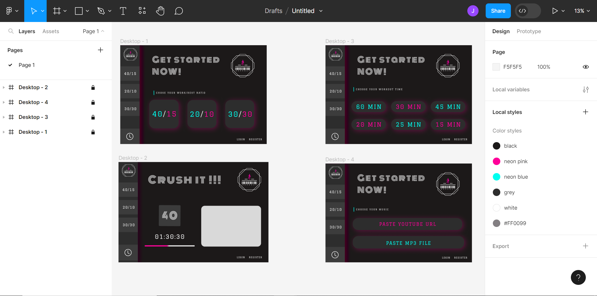

# CS50W — Final Project: Workout
## Video Demo: https://www.youtube.com/watch?v=AoUfKmqRUQM
## Deployed version: https://julsmx.pythonanywhere.com/
## What is Workout?
It is a django website that allows you to have various interval workouts, with your chosen music on the background. It also keeps log of all the workouts that you have done.

## Why Workout?
I just couldn't really find anything like it on the internet, and figured that it whould really make my life a lot easier if a had a website like this at my disposal, so I decided to create one.

## Skills learned in the process:
One of my goals for creating this website was to improve my front-end / UI / UX skills. I really wanted the website to be good looking and at the same time unique in its interface. To accomplish that I dove a little deeper into the Sass and CSS languages and also learned to design websites with Figma. To continue to improve the look of the website I learned how to create a unique logo and a favicon. I also learned a ton about working with audio files along the way.

### Figma Design:

## Distinctiveness and Complexity:
This project has a much heavier emphasis on the UI and front end than all the previous ones, and deliberately so. It is designed to look modern and cool yet be intuitive in its usage. Besides that, while creating this project I also had to deal with iframes and audio which wasn't present in any of the previous projects. Also, designing a woukout interval timer and adding sound effects to it turned out to be pretty complex in itself. All in all, the only evident thing that this project has in common with the other ones is the logic behind user authentification.

## What’s contained in each file:
- **`media`**:  all the mp3 files selected by users
- **`views.py`**:  all of the project's views as well as creating a form for sumbiting mp3 files
- **`models.py`**:  two of the website models, namely User and Workout 
- **`urls.py`**:  all the website urls 
- **`admin.py`**: registers models to Django admin interface
- **`static`**:
    -  mp3 sound effects
    -  **`images`**:
        - logo image, favicon and a clock icon
    -  **`scripts`**:
        - `music.js` for managing youtube url input as well as audio input
        - `timer.js` contains all the logic for workout interval timer with sound effects
    - **`styles`**:
        - `styles.scss`: main styles file that contain all the css for layout
        - `_variables.scss`: all the custom colors, fonts and mixins
        - `_player.scss`: styles for the workout timer and music player
        - `_forms.scss`: styles for login and register forms
        - `_boxButtons.scss`: styles for custom box buttons and input fields
        - `styles.css`: compiled version of styles.scss
- **`templates`**:
    - `layout.html`: layout for all the other pages
    - `index.html`: main page
    - `login.html`: login page
    - `register.html`: register page
    - `time.html`: page where a user can choose workout duration
    - `music.html`: page where a user can choose workout music
    - `player.html`: page that diplays a workout timer as well as a player with music
    - `history.html`: displays user's workout history

## How to run my app
 - install `django`
 - run `cd final_project` in the terminal
 - run `python3 manage.py runserver` in the terminal
 - or just go to the deployed website on https://julsmx.pythonanywhere.com/
